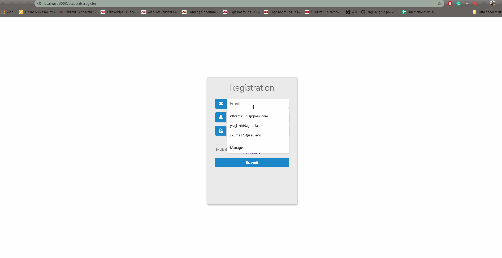

# CyberDriveAssessment
## Api Credentials End point

### User Stories

- [X]  Endpoint for registration requres a user name, email, and password that meets basic complexity requirements. 
- [X] Login endpoint issues some type of token for authentication.
- [X] Logout endpoint causes the issued token to become invalid
- [X] Change password endpoint requires current password to be correct in order to apply new password. New password must meet complexity requirements.
- [X] Change username & change email endpoint requires current password.
- [X] Use the built-in SQLite database for the project.
- [X] The API should be run with the command: python manage.py runserver without any issues.
- [X] The API should have a superuser & a working admin dashboard. Include the superuser login credentials in your submission.

### App Walkthough GIF

 

## Open-source libraries used
- [Android Async HTTP](https://github.com/codepath/CPAsyncHttpClient) - Simple asynchronous HTTP requests with JSON parsing
